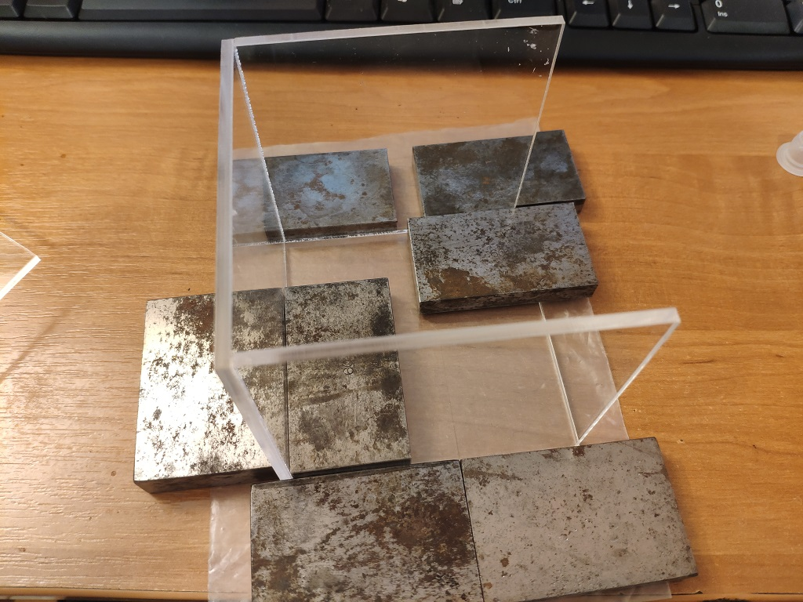

<h2 align="center">Светодиодный куб 8х8х8</h2>

Давно мне хотелось собрать светодиодный куб с большим количеством эффектов. 
В данном репозитории есть <a href="https://github.com/Kemtop/LedCube">версия на 64 светодиода.</a> Но там мало эффектов.
В этот раз захотелось сделать куб 8х8х8 = 512 светодиодов. Что бы помещался в руку и работал от батареи.

Куб делался на подарок, в ограниченное время. Поэтому решено было взять готовую прошивку от Alex Gyver. С надеждой что там все красиво и грамотно написано.
Была идея добавить вторую плату Arduino, которая будет слушать музыку и выполнять быстрое преобразование Фурье. Передавать данные плате управления кубом. Но не хватило времени на огромную доработку прошивки Алекса.

Из-за невозможности вывода русского текста, и наличия не красивых эффектов, прошивку все таки пришлось доработать.

У Алекса куб монтируется на большой печатной плате. И в сборе он скорее все не поместиться в рюкзак. А мне нужен что бы вмещался в руку. Печатную плату пришлось разводить с нуля.
Куб будет иметь внешние размеры 90x90x90мм. Сделан из акрила толщиной 3мм.

Самое сложное в этом проекте – разводка компактной(84х84mm) печатной платы, которую можно
изготовить дома методом ЛУТ.

Для термотрансферной бумаги минимальный шаг между дорожками 0,25мм, их ширина 0,4мм. При таких нормах тех процесса – вероятность удачного перевода рисунка на фольгу равна 90%.

Ну и не забываем что у вас двухсторонняя печатная плата, и перемычки между слоями придётся паять руками
Сделать такое дома весьма не простая задача. 

 

Разводка платы в Sprint Layout 6 заняла 3 часа. Ну и еще десятка два проверок на пол часа. В случайные промежутки времени, в течении пары дней. Ведь шанса на ошибку у вас нет.

Написать unit тест для деталей распаянных на данной плате будет отдельная задача.
Поэтому применяем «глазо тест». В случайные промежутки времени, в разном состоянии организма (утро, день, вечер) .
Такой подход позволяет получить минимум ошибок в разводке платы.

Светодиоды будут уже распаяны. И что то править будет крайне не просто(резать дорожки например).  

<a href="./Boards">Шаблон платы, и сетка для распайки светодиодов</a>

Пример шаблона для верхнего слоя. 
 
Фото с распаянными межслойными перемычками. Для них просверлены отверстия 0,5мм. 
 

Вторая супер сложность – распаять матрицу из 512 светодиодов.
Идея процесса взята у Алекса. Но для мелких светодиодов(диаметр 3мм) пришлось ее доработать. Паяем слой из 8 светодиодов, потом по бумажному шаблону спаиваем в вертикаль. 
 
 
 

При помощи usb->usart прошиваем плату arduino pro mini.
 

Запускаем многочасовой тест работы от батареи. Что бы ни чего не грелось и не сгорело. 
 
Куб отработал более 3х часов. Потом я пошел спать, с надеждой что к утру сядет.
Батарея установлена на 1000мА часов.  И к утру куб действительно разрядился.

Чертеж корпуса для лазерной резки нарисован от руки. 
 

Планировалось использовать болты для фиксации нижней крышки(детали 7х50). Но допуски между платой и матрицей из-за особенности её сборки пришлось сделать больше. 
Раз это подарок-ни кто не будет дописывать прошивку. Нижняя крышка будет приклеена.

Клеем корпус. В качестве клея использован раствор акрила в дихлорэтане.
В качестве углов 90градусов - металические калибровочные бруски
 

И как вы уже поняли внутри литиевая батарея, готовая плата зарядки и повышающий преобразователь. Которые есть в любом радиомагазине.

Удаляем большой переменный резистор в модуле преобразователя SX1308.
Для 5в на выходе в делители должны быть резисторы 10к и 73,2к 1%.
Вместо 10к получился 1к+10к. Вместо 73,2 – столбик друг на друге 82к и 909к 1%.

Плата разводилась под транзисторы Алекса, но зачем использовать такие огромные транзисторы, да еще и на такие токи я не понял.
Заменил на SS8050.

Через изоляционные прокладки, поверх основной платы монтируем не достающие модули.
Помещаем электронику в корпус, занимаемся фрезеровкой нижней крышки.
 
Основная платы покрыта лаком. 

Клеим нижнюю крышку. 

Кнопки использовал сенсорные. 

Первый режим - фонарик. 

Короткое прикосновение замедляет/увеличивает скорость.
Длинное переключает эффект по кругу. 
Соответственно две кнопки: 
- переключить эффект в лево/замедлить эффект.  
- переключить эффект в право/ускорить эффект. 

Описание устройства позаимствовано с сайта Marvel.
Так как получатель подарка их фанат.

Не корректные надписи кнопок на английском – сокращения
в стиле старых станков, где на бирке не обязана быть надпись на правильном английском языке.
Например «Level Generator». А ни какого генератора в станке нет.  Без мануала управление не возможно. 

Если захотите повторить увеличьте допуски - думаю +10мм в размере корпуса будет достаточно.

Вообще лучше использовать wifi модуль  ESP8266 совместно с платой регистров.
Тогда сенсорные кнопки не понадобиться. И в теории можно обновлять прошивку по воздуху.

